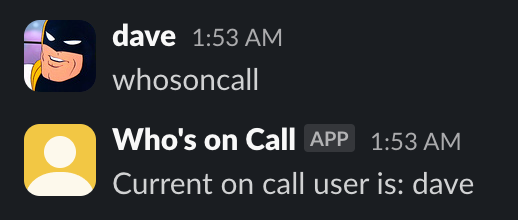

#dd-whos-on-call
---
it's a slackbot that tells you who's currently on call for your datadog team rotation.
once again the result of me staying up too late and deciding to write some code.

## look, it actually works:

presented as-is, no frills. wouldn't recommend anyone actually use this. missing pretty much every feature that would make this worth using. maybe I'll expand on this eventually.

(probably wont tho)
